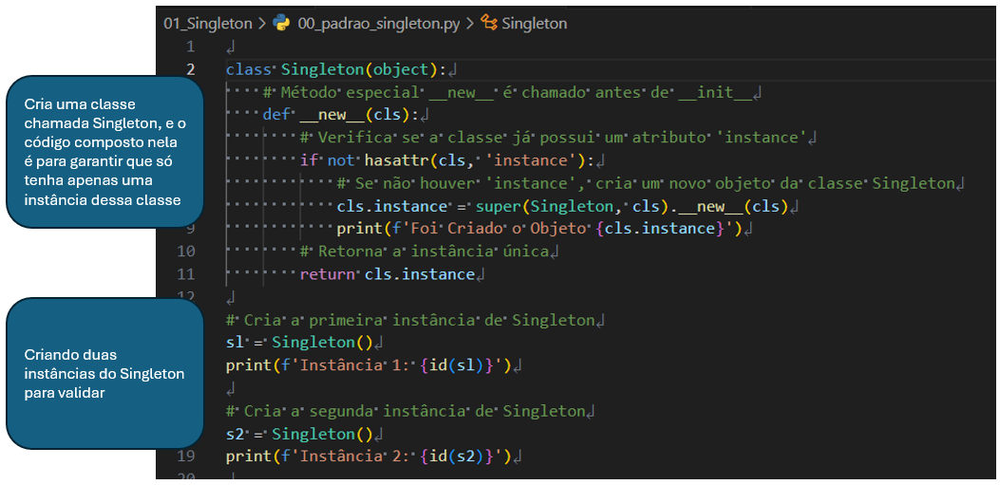
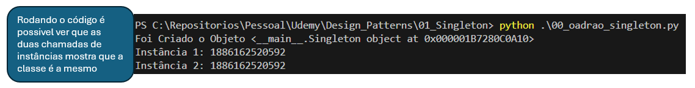
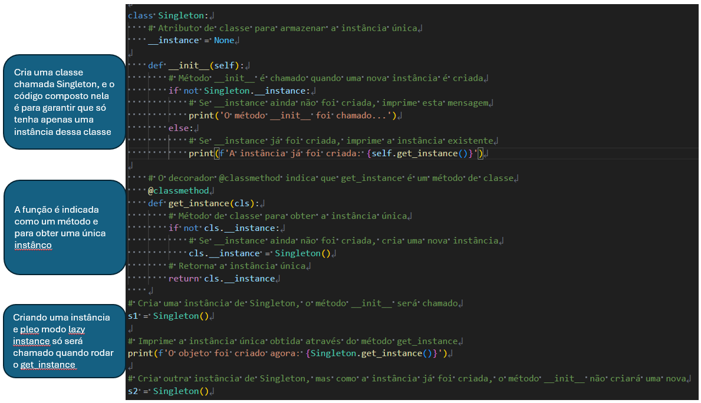
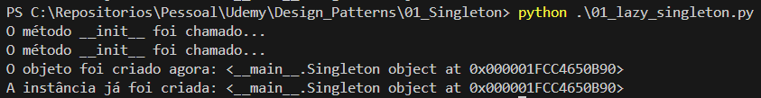
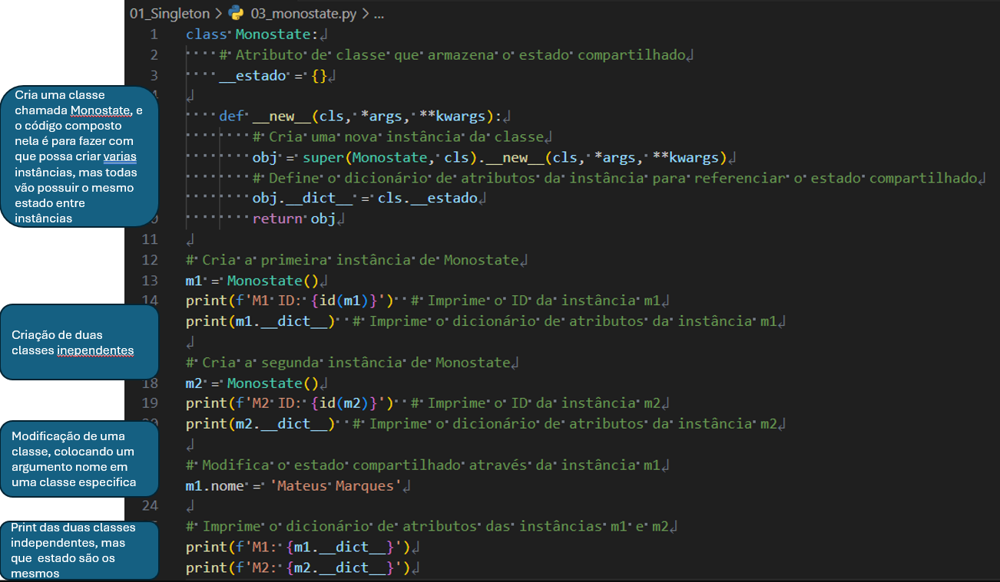
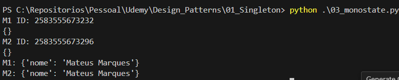

# Singleton

kbkj

  
singleton

   
  ## Executando o arquivo `00_padrao_singleton.py`

Este script demonstra de maneira simplificada as funcionalidades de como deve ser feito o padrão singleton, que tem como base a ideia de ter apenas um objeto da mesma instância

  

Resultado:
  

  ## Executando o arquivo `01_lazy_singleton.py`

Este código implementa o padrão de design Singleton com inicialização tardia (lazy initialization). Isso garante que apenas uma instância da classe Singleton seja criada, e essa instância é criada somente quando é realmente necessária.

  

Resultado:

A instância única da classe Singleton só é criada quando o método get_instance é chamado pela primeira vez. Isso economiza recursos, pois a instância não é criada até que seja realmente necessária.

  

## Obs: 
`Quando trabalhamos com arquivos python e fazemos importação de um arquivo.py (que no baixo dos panos é um módulo) em outro arquivo.py significa que o python faz que se torne o padrão singleton.`

  ## Executando o arquivo `03_monostate.py`

Este script demonstra o modo de criação de várias instâncias de um objeto, contudo, o estado é compartilhado entre as instâncias

  

Resultado:
  

